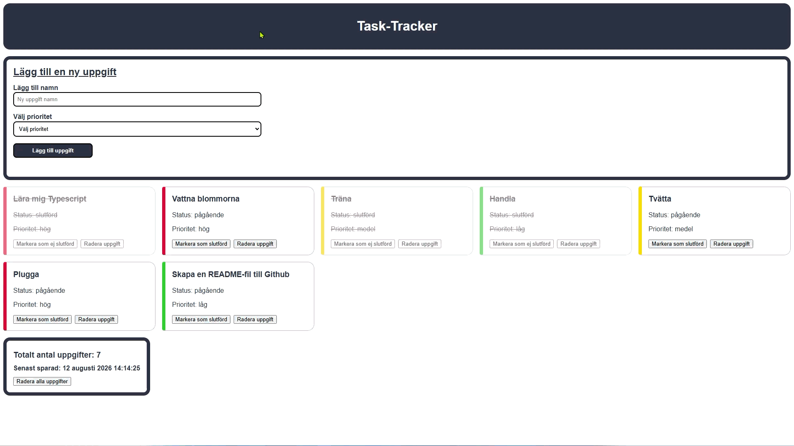
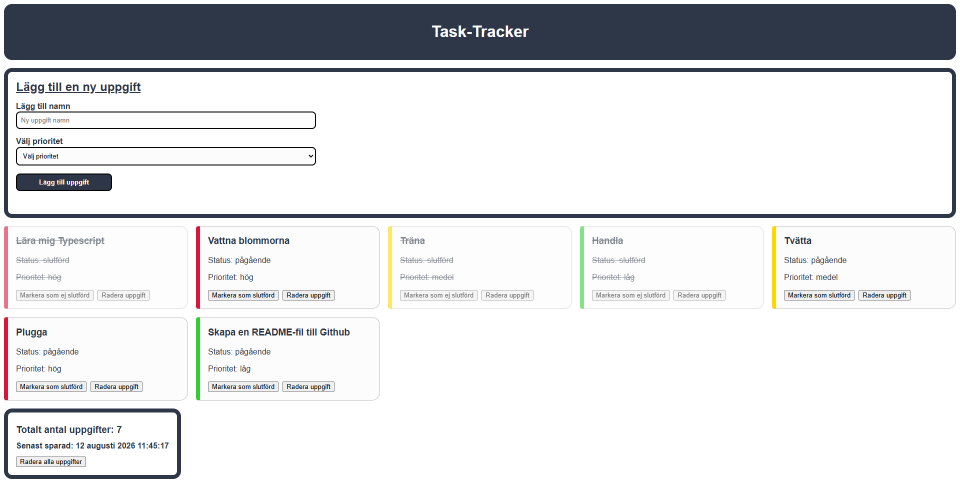

# ⚠️README-file is still a Work-in-progress⚠️


# ✅ Task-Tracker | Frontend education project #3

The third project I worked on during the Frontend education at Lexicon.

It is a website for managing tasks and assignments. Basically a to do list. The user can add tasks, and marked tasks as completed and also delete them. All created tasks are saved in the browser, even if you close down the program and come back to it later.

All functionality is built with TypeScript which was this projects focus. Therefore the HTML and CSS is quite basic.

> [!NOTE]
> The website is entirely in Swedish, as well as most code comments and Git Commit messages.

---



---


## 🚀 Features

- ➕ Add tasks with a name and a priority of low, medium or high.
- ✅ You can mark a task as completed or delete it.
- 💾 All tasks are saved in the browser, even between sessions.
- 🕑 See when you last made a change to your tasks.
- 📱 Responsive design


## ⚙️ Technologies

|  Technology  |       Used for       |
| ------------ | -------------------- |
| HTML         | Markup               |
| CSS          | Styling              |
| TypeScript   | Adding functionality |
| Git          | Version controll     |
| GitHub       | Remote repository    |


## 📋 Requirements

- **Node.js** v.24.18.1+
- **npm** v.12.0.2+
- **Git**


## 📦 Installation

1. Clone the repository or download the ZIP-file from GitHub.
``` bash
git clone https://github.com/wilkin-2005/task-tracker.git
```

2. Open the project folder `task-tracker` with Visual Studio Code.

3. Install dependencies by running `npm install` in VS Code's built-in terminal.

4. Compile the TypeScript into JavaScript by running `npx tsc` in the VS Code terminal.

5. Open the file [`index.html`](./index.html) with the VS Code extension [Live Server](https://marketplace.visualstudio.com/items?itemName=ritwickdey.LiveServer) by Ritwick Dey.  

6. The application should automatically open in your browser.

> [!NOTE]
> When the application is opened for the first time, there won't be any tasks there.


## ▶️ Usage

1. Open the application.
2. Write the name of your task in the task name field.
3. Chose a priority *"låg"*, *"medel"* or *"hög"* (Swedish for *"low"*, *"medium"* and *"high"*).
4. Click on the add task button, "Lägg till uppgift" in Swedish.
5. Click on the button to mark your new task as completed ("Markera som slutförd" in Swedish). Can be toggled back and forth.
6. Delete your task by clicking on the button on your task that says "Radera uppgift".

> [!TIP]
> You can delete all your tasks at once by pressing the button "Radera alla uppgifter" located right below the last saved text. When pressed you will see a pop-up asking you to confirm before deleting.

---



---